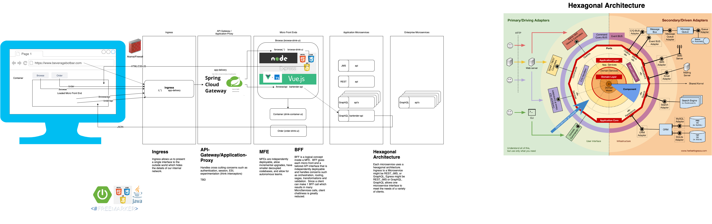

# bar-stack Architecture


## Techniques, Patterns and Technologies
Techniques
* Microfontends
* API Gateway Per Microfrontend (Backends For Frontends (BFF))
* Microservices
* Eventsourcing
* CQRS

Microfrontends
* NodeJs/Express

API Gateway
* Spring Cloud Gateway

Microservice API's
* GraphQL | REST (Jersey) | JMS
* Spring cloud config
* Spring cloud sleuth
* Spring cloud contracts
* Eventuate local
* Gauge for acceptance tests (component test)
* Gauge + Taiko for user journey e2e tests
* Docker

Network
* Kuma service mesh
* Kubernetes

Microservices Patterns by Chris Richardson
https://www.evernote.com/shard/s728/sh/e21325cc-2f69-483b-a0fc-9047abb29b9e/0bcceb7a682cab3f96aa3cee8139b519

Links
[We choose to have a BFF per micro frontend. This allowed us to provide more flexibility to the team. For example, the account domain team, has their own account BFF.](https://medium.com/passionate-people/my-experience-using-micro-frontends-e99a1ad6ed32)
[Micro Frontends](https://martinfowler.com/articles/micro-frontends.html)
[Event Sourcing](http://eventuate.io/gettingstarted-es.html)

# Local Setup
## Checkout Code
```
mkdir bar
cd bar
git clone https://github.com/SamAllen83/bar-stack.git
git clone https://github.com/SamAllen83/bartender.git
git clone https://github.com/SamAllen83/config-server.git
git clone https://github.com/SamAllen83/browse-drink-ui.git
git clone https://github.com/SamAllen83/drink-container-ui.git
git clone https://github.com/SamAllen83/order-drink-ui.git
git clone https://github.com/SamAllen83/order-drink-api-gateway.git
git clone https://github.com/SamAllen83/browse-drink-api-gateway.git
git clone https://github.com/SamAllen83/config-server.git
cd bar-stack
```

## Kubernetes Using Docker For Mac
Make sure Kubernetes is running on your Mac and docker-for-desktop context is selected so you can deploy to your local kubernetes.
https://matthewpalmer.net/kubernetes-app-developer/articles/how-to-run-local-kubernetes-docker-for-mac.html

## Onetime setup
Map `beveragebotbar.com` to 127.0.0.1 in /etc/hosts

You need to create an nginx ingress controller, this only needs to be done once (ever)
```
kubectl apply -f https://raw.githubusercontent.com/kubernetes/ingress-nginx/master/deploy/static/mandatory.yaml

kubectl apply -f https://raw.githubusercontent.com/kubernetes/ingress-nginx/master/deploy/static/provider/cloud-generic.yaml

kubectl get pods --all-namespaces -l app.kubernetes.io/name=ingress-nginx --watch
 ```
Once the operator pods are running, you can cancel the above command by typing Ctrl+C. Now, you are ready to create your first ingress.

## Run locally
1. Build everything and install images locally: ```./dockerdesktopk8s-build.sh```
1. Run everything: ```./start.sh```
1. Verify things are working.  Hit URL in browser: ```http://beveragebotbar.com/```
    
## Shutdown
```./stop.sh```