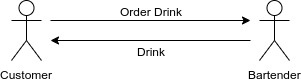

# bar-stack

# Architecture

## Microfrontends, microservices, eventsourcing and CQRS
Techniques
* Microfontends
* Microservices
* Eventsourcing

Microservice API's
* GraphQL | REST (Jersey)
* Spring cloud config
* Spring cloud sleuth
* Spring cloud contracts
* Eventuate local
* Gauge for acceptance tests (component test)
* Gauge + Taiko for user journey e2e tests
* Docker

Network
* Backends-for-front-ends (Spring Cloud Gateway) for each microfrontend
* Istio service mesh
* Kubernetes

Microservices Patterns by Chris Richardson
https://www.evernote.com/shard/s728/sh/e21325cc-2f69-483b-a0fc-9047abb29b9e/0bcceb7a682cab3f96aa3cee8139b519

Links
[We choose to have a BFF per micro frontend. This allowed us to provide more flexibility to the team. For example, the account domain team, has their own account BFF.](https://medium.com/passionate-people/my-experience-using-micro-frontends-e99a1ad6ed32)
[Micro Frontends](https://martinfowler.com/articles/micro-frontends.html)
[Event Sourcing](http://eventuate.io/gettingstarted-es.html)

WIP
Caused by: java.lang.RuntimeException: Driver com.mysql.jdbc.Driver claims to not accept jdbcUrl, jdbc:10.152.183.115://mysql/eventuate
